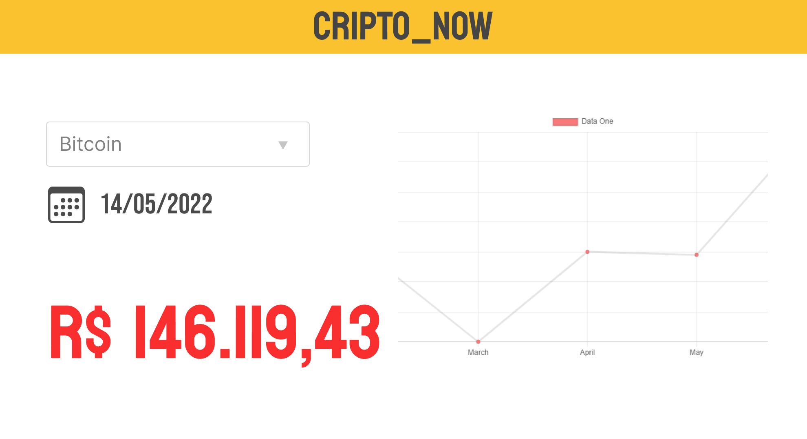
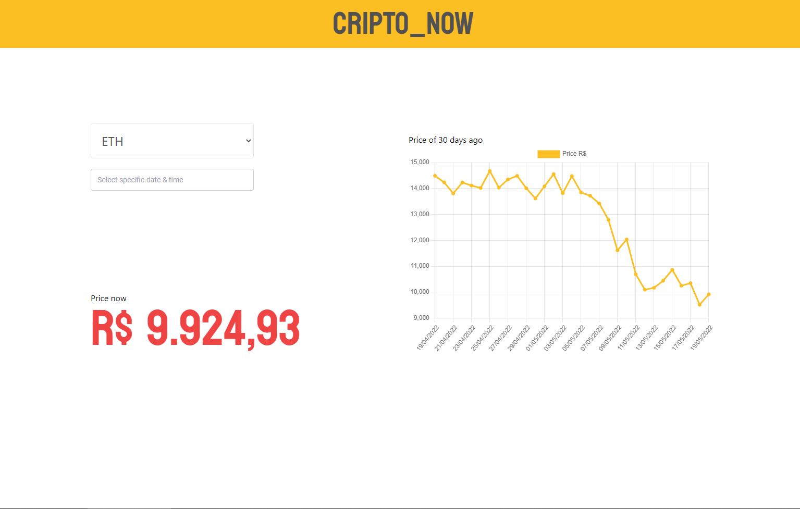
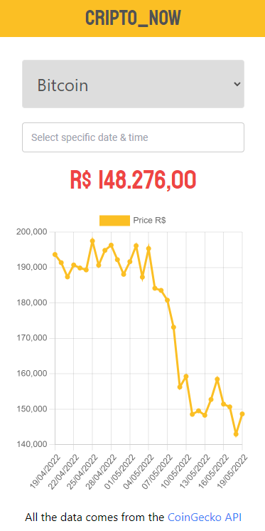

# Cripto_Now

[Cripto_Now](https://kaio-matos.github.io/Cripto_Now/)

Para o desenvolvimento do aplicativo foi feita a leitura detalhada do que é pedido no PDF. Após a leitura, a primeira coisa que decidi fazer foi construir a prototipagem no figma de como ficaria a tela, algo simples para que durante o desenvolvimento eu pudesse me guiar.

Após ter feito o protótipo pelo fato de saber apenas React e nunca ter usado Vue, resolvi primeiramente fazer um curso bem básico que se encontra no própria documentação deles.

Durante os estudos do curso e outros vídeos/documentação/fóruns, vi que existiam duas formas de manusear os dados e funções no Vue. A primeira e mais antiga seria a Options API, e a segunda que veio agora com o Vue 3 que seria a Composition API.

Pelo fato de me sentir mais confortável e achar mais parecida com o React resolvi usar a Composition API para o desenvolvimento.

Os primeiros passos foram basicamente a instalação do template padrão da vue-cli e depois adicionando o tailwindcss, pois já sabia que iria ter de utilizar durante todo o desenvolvimento da tela.

Então montei os componentes básicos que tinha feito no protótipo.

A partir desse momento eu já tinha uma base para começar a experimentar a API que a CoinGecko fornece.

Baseado em outras experiências fazendo chamadas a API's, resolvi não tratar os erros dentro da classe Api, mas sim tratar qualquer erro no componente para que eu tivesse acesso ao seu texto de forma prática e pudesse mostrar o erro em tela.

Para a implementação do real time ao mostrar o preço das moedas, procurando na documentação da API não encontrei nada relacionado a isso, por esse motivo estou fazendo uma requisição a API deles a cada 10 segundos para manter o dado atualizado.

Depois de ter concluído as funcionalidades, fui fazer a responsividade do site, e então percebi o péssimo erro que cometi ao notar que o Tailwind tem a proposta de ser mobile-first. Então comecei a corrigir minhas classes e o que tinha feito para manter organizado.

Para concluir notei que quando subi em produção o tempo de carregamento estava longo demais e não havia nada em tela que notificasse isso, então implementei um componente para carregamento e usei as diretivas do vue e a classe de transition que havia desenvolvido para mostrar o carregamento ocorrendo.

### Obrigatórios

- Feature 1: Show the current Bitcoin price in real time. The price must be updated on the
screen without needing to refresh the browser.
- Feature 2: The customer can input a date and a time and the application will present the Bitcoin price in the provided date and time.


| Order         | Description                                                                                                | Done |
| ------------- |:----------------------------------------------------------------------------------------------------------:|:----:|
| Requirement 1 | Create the application using Vue.js                                                                        | ✔   |
| Requirement 2 | Use whatever you prefer to style your code                                                                 | ✔   |
| Requirement 3 | Use the CoinGecko API Documentation as a source of both the bitcoin current price and the historical price | ✔   |
| Requirement 4 | Responsive design. The application must look good on both small and big screens                            | ✔   |
| Requirement 5 | Publish on Github Pages; How to deploy on github pages and/or Deploying to GitHub Pages                    | ✔   |

<br>

### Opcionais
| Order   | Description                                                                                                | Done |
| ------- |:----------------------------------------------------------------------------------------------------------:|:----:|
| Bonus 1 | Use Tailwind as css in requirement 2                                                                       | ✔   |
| Bonus 2 | The application also presents the following coin prices: DACXI, ETH, ATOM, LUNA. For this bonus, the user also must be possible to search the historical price of any of those coins                                    | ✔   |
| Bonus 3 | Use CSS animations                                                                                         | ✔   |
| Bonus 4 | Automated Tests - Unit Tests (Jest) and/or E2E (Cypress ou Playwright)                                     | ❌  |

<br>
<hr>

## Protótipo



## Resultado final




<br>
<hr>

## Tecnologias e bibliotecas 📚

#### Tecnologias 
- Vue.js
- Javascript
- Html
- Css

#### Bibliotecas
- Tailwind.css
	- Tailwind é um framework de css que ajuda no 		 desenvolvimento de interfaces, assim ganhamos velocidade e praticidade no desenvolvimento.

- Chart | Vue Chart
	- Chart.js é uma biblioteca javascript que permite a construção de gráficos customizáveis e com uma boa aparência.

- Ctk Date Time Picker
	- Ctk Date Time Picker é uma biblioteca que permite usar um componente para a escolha de data e hora construido em Vue.

<br>
<hr>

## Setup 💻

### Requisitos 🏳️

- Node.js
- NPM / Yarn


Primeiramente faça a instalação das dependências:

```
yarn install
npm install
```

### Desenvolvimento 🏗️

Para servir os arquivos como um servidor de desenvolvimento e hot-reload:

```
yarn serve
npm run serve
```

### Produção 🚀

Instale o pacote do npm 'serve' globalmente. Este pacote auxiliará a servir os arquivos e páginas de forma estática, neste caso é apenas o index.html.

```
npm install -g serve
yarn global add serve
```

Remova a configuração para o github-pages no arquivo vue.config.js

```js
const { defineConfig } = require('@vue/cli-service')
module.exports = defineConfig({
  publicPath: process.env.NODE_ENV === "production" ? "/Finished-Frontend-Technical-Test/" : "/", // Remova essa linha
  transpileDependencies: true
})

```

Faça o build da aplicação

```
yarn build
npm run build
```

Então execute o seguinte comando para abrir o servidor

```
serve dist
```

